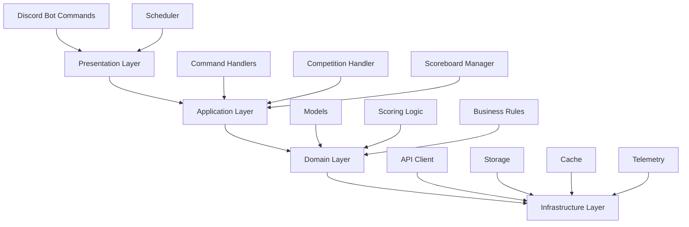
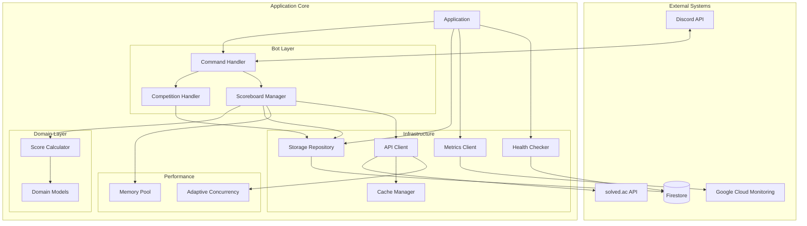
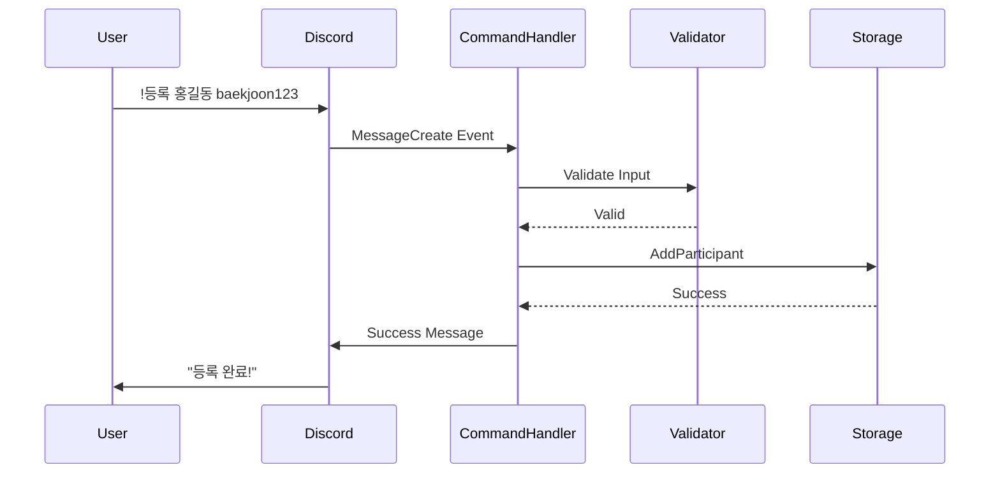
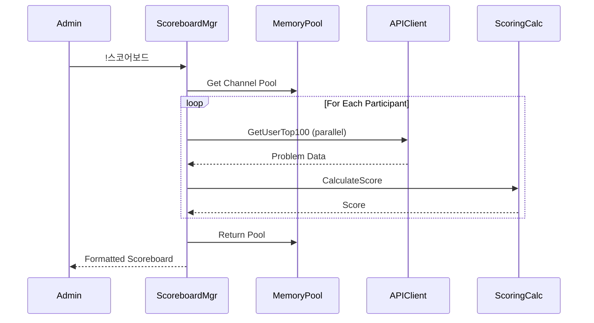
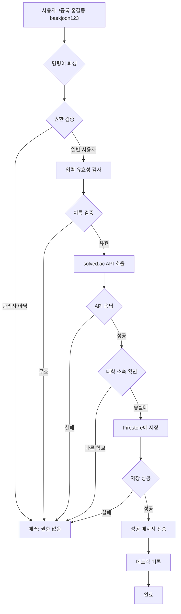
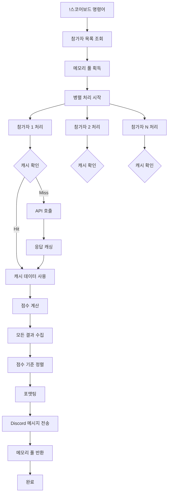
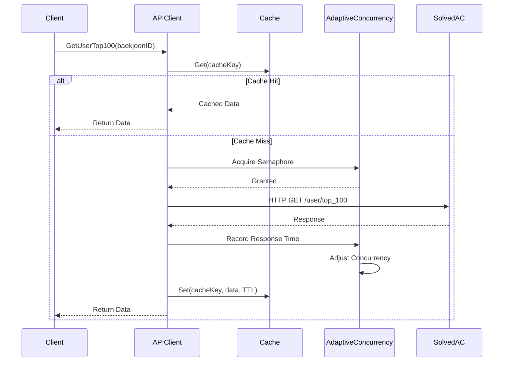
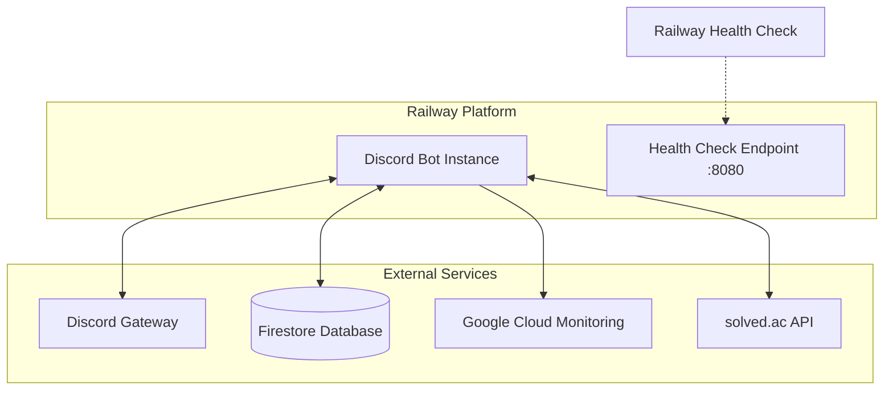

# 깨미 봇 아키텍처 문서

## 목차
- [시스템 개요](#시스템-개요)
- [아키텍처 원칙](#아키텍처-원칙)
- [레이어 아키텍처](#레이어-아키텍처)
- [컴포넌트 구조](#컴포넌트-구조)
- [데이터 플로우](#데이터-플로우)
- [동시성 모델](#동시성-모델)
- [에러 처리 전략](#에러-처리-전략)
- [성능 최적화](#성능-최적화)
- [배포 아키텍처](#배포-아키텍처)

---

## 시스템 개요

깨미는 백준 알고리즘 대회를 관리하고 스코어보드를 제공하는 Discord 봇입니다. Go 언어로 작성되었으며, 클린 아키텍처와 의존성 주입 패턴을 따릅니다.

### 핵심 기술 스택
- **언어**: Go 1.25.0
- **Discord 라이브러리**: DiscordGo v0.29.0
- **데이터베이스**: Firebase Firestore
- **캐싱**: In-Memory TTL Cache
- **모니터링**: Google Cloud Monitoring
- **API**: solved.ac REST API

---

## 아키텍처 원칙

### 1. **의존성 역전 (Dependency Inversion)**
- 모든 핵심 컴포넌트는 인터페이스에 의존
- `interfaces/` 패키지에 계약 정의
- 구현체 교체 가능 (예: Firestore ↔ InMemory)

### 2. **단일 책임 원칙 (Single Responsibility)**
- 각 패키지는 명확한 단일 목적
- 예: `scoring/`은 점수 계산만, `storage/`는 데이터 저장만

### 3. **인터페이스 분리 (Interface Segregation)**
- 작고 집중된 인터페이스
- 클라이언트는 필요한 메서드만 의존

### 4. **개방-폐쇄 원칙 (Open-Closed)**
- 확장에는 열려있고 수정에는 닫혀있음
- 새 스토리지 추가 시 기존 코드 변경 불필요

---

## 레이어 아키텍처



### Layer 설명

#### 1. **Presentation Layer** (프레젠테이션 계층)
- **역할**: 외부 입력 수신 및 출력 전송
- **패키지**: `bot/`, `scheduler/`
- **책임**:
  - Discord 명령어 파싱
  - 사용자 응답 포맷팅
  - 스케줄링 트리거

#### 2. **Application Layer** (애플리케이션 계층)
- **역할**: 비즈니스 흐름 조율
- **패키지**: `bot/command_handlers.go`, `bot/competition_handler.go`
- **책임**:
  - 명령어 실행 흐름 관리
  - 트랜잭션 조율
  - 권한 검증

#### 3. **Domain Layer** (도메인 계층)
- **역할**: 핵심 비즈니스 로직
- **패키지**: `models/`, `scoring/`, `interfaces/`
- **책임**:
  - 점수 계산 알고리즘
  - 비즈니스 규칙 적용
  - 도메인 모델 정의

#### 4. **Infrastructure Layer** (인프라 계층)
- **역할**: 외부 시스템 연동
- **패키지**: `api/`, `storage/`, `cache/`, `telemetry/`
- **책임**:
  - API 호출
  - 데이터 저장/조회
  - 캐싱 및 성능 최적화

---

## 컴포넌트 구조

### 전체 시스템 컴포넌트 다이어그램



### 주요 컴포넌트 상세

#### 1. **Application (`app/app.go`)**
- **역할**: 애플리케이션 생명주기 관리
- **책임**:
  - 컴포넌트 초기화 및 와이어링
  - Graceful shutdown 처리
  - 이벤트 핸들러 등록

```go
type Application struct {
    session         *discordgo.Session
    storage         interfaces.StorageRepository
    apiClient       interfaces.APIClient
    scheduler       *scheduler.Scheduler
    metricsClient   *telemetry.MetricsClient
    healthChecker   *health.HealthChecker
}
```

#### 2. **Command Handler (`bot/commands.go`)**
- **역할**: Discord 명령어 처리
- **책임**:
  - 명령어 라우팅
  - 권한 검증
  - 입력 유효성 검사

**명령어 처리 흐름**:


#### 3. **Scoreboard Manager (`bot/scoreboard.go`)**
- **역할**: 스코어보드 생성 및 관리
- **책임**:
  - 병렬 점수 계산
  - 메모리 풀 관리
  - 데이터 정렬 및 포맷팅

**스코어보드 생성 흐름**:


#### 4. **API Client (`api/solvedac.go`)**
- **역할**: solved.ac API 통신
- **책임**:
  - HTTP 요청 처리
  - 응답 파싱
  - 캐시 조회/저장
  - 재시도 로직

```go
type CachedSolvedACClient struct {
    baseURL            string
    cache              *cache.APICache
    httpClient         *http.Client
    concurrencyManager *performance.AdaptiveConcurrencyManager
}
```

#### 5. **Storage Repository (`storage/storage.go`)**
- **역할**: 데이터 영속성 관리
- **구현체**:
  - `FirebaseStorage`: Firestore 기반
  - `InMemoryStorage`: 메모리 기반 (테스트용)

**Storage 인터페이스**:
```go
type StorageRepository interface {
    // 참가자 관리
    GetParticipants() []models.Participant
    AddParticipant(name, baekjoonID string, ...) error
    RemoveParticipant(baekjoonID string) error

    // 대회 관리
    GetCompetition() *models.Competition
    CreateCompetition(name string, ...) error
    SetScoreboardVisibility(visible bool) error

    // 리소스 정리
    Close() error
}
```

#### 6. **Cache Manager (`cache/cache.go`)**
- **역할**: API 응답 캐싱
- **전략**: TTL 기반 자동 만료
- **구조**:
  - Priority Queue로 만료 관리
  - RWMutex로 동시성 제어

```go
type APICache struct {
    mu          sync.RWMutex
    entries     map[string]*CacheEntry
    expiryQueue PriorityQueue
    ttl         time.Duration
}
```

---

## 데이터 플로우

### 1. 참가자 등록 플로우



### 2. 스코어보드 생성 플로우



### 3. API 요청 플로우 (캐싱 포함)



---

## 동시성 모델

### 1. Goroutine 사용 패턴

#### **스코어보드 병렬 처리**
```go
// 워커 풀 패턴
semaphore := make(chan struct{}, maxConcurrent)
var wg sync.WaitGroup

for _, participant := range participants {
    wg.Add(1)
    go func(p models.Participant) {
        defer wg.Done()
        semaphore <- struct{}{}        // 획득
        defer func() { <-semaphore }() // 반환

        // 작업 수행
        score := calculateScore(p)
        results <- score
    }(participant)
}

wg.Wait()
```

#### **적응형 동시성 관리**
- **목적**: API 응답 시간에 따라 동시 요청 수 자동 조절
- **알고리즘**:
  1. 응답 시간 윈도우(50개) 유지
  2. P95 응답시간이 1초 초과 → 동시성 감소
  3. 평균 응답시간이 250ms 미만 → 동시성 증가
  4. 최소 2개, 최대 20개로 제한

```go
type AdaptiveConcurrencyManager struct {
    mutex               sync.RWMutex
    currentLimit        int
    responseTimeWindow  []time.Duration
    // ...
}

func (m *AdaptiveConcurrencyManager) RecordResponseTime(rt time.Duration) {
    m.mutex.Lock()
    defer m.mutex.Unlock()

    m.responseTimeWindow = append(m.responseTimeWindow, rt)
    if len(m.responseTimeWindow) > m.windowSize {
        m.responseTimeWindow = m.responseTimeWindow[1:]
    }

    if shouldAdjust() {
        m.adjustConcurrency()
    }
}
```

### 2. 메모리 풀 패턴

**문제점**: 스코어보드 생성 시 대량의 임시 채널 객체 생성 → GC 압박

**해결책**: sync.Pool을 사용한 객체 재사용

```go
type ChannelMemoryPool struct {
    pool *sync.Pool
}

func (p *ChannelMemoryPool) Get() chan ScoreResult {
    ch := p.pool.Get().(chan ScoreResult)
    return ch
}

func (p *ChannelMemoryPool) Put(ch chan ScoreResult) {
    // 채널 비우기 (중요!)
    select {
    case <-ch:
    default:
    }
    p.pool.Put(ch)
}
```

### 3. 동시성 안전성 보장

#### **RWMutex 사용**
- **읽기 잠금**: 여러 고루틴이 동시에 읽기 가능
- **쓰기 잠금**: 독점적 접근 필요

```go
// 캐시 읽기 (RLock)
func (c *APICache) Get(key string) (interface{}, bool) {
    c.mu.RLock()
    defer c.mu.RUnlock()

    entry, exists := c.entries[key]
    if !exists || time.Now().After(entry.ExpiryTime) {
        return nil, false
    }
    return entry.Data, true
}

// 캐시 쓰기 (Lock)
func (c *APICache) Set(key string, value interface{}) {
    c.mu.Lock()
    defer c.mu.Unlock()

    entry := &CacheEntry{
        Data:       value,
        ExpiryTime: time.Now().Add(c.ttl),
    }
    c.entries[key] = entry
}
```

---

## 에러 처리 전략

### 1. 타입별 에러 분류

```go
// errors/errors.go
type ErrorType string

const (
    ValidationError   ErrorType = "VALIDATION_ERROR"
    PermissionError   ErrorType = "PERMISSION_ERROR"
    NotFoundError     ErrorType = "NOT_FOUND_ERROR"
    ExternalAPIError  ErrorType = "EXTERNAL_API_ERROR"
    DatabaseError     ErrorType = "DATABASE_ERROR"
    InternalError     ErrorType = "INTERNAL_ERROR"
)

type CustomError struct {
    Type       ErrorType
    Message    string
    StatusCode int
    Details    map[string]interface{}
    Err        error
}
```

### 2. 에러 헬퍼 팩토리 패턴

```go
type ErrorHandlerFactory struct {
    session   *discordgo.Session
    channelID string
}

func (f *ErrorHandlerFactory) Validation() *ValidationErrorHelper {
    return &ValidationErrorHelper{session: f.session, channelID: f.channelID}
}

// 사용 예시
errorHandlers := utils.NewErrorHandlerFactory(session, channelID)
errorHandlers.Validation().HandleInvalidBaekjoonID(baekjoonID)
```

### 3. 재시도 로직

```go
func (client *CachedSolvedACClient) getWithRetry(url string) (*http.Response, error) {
    var resp *http.Response
    var err error

    for attempt := 0; attempt <= constants.MaxRetries; attempt++ {
        resp, err = client.httpClient.Get(url)
        if err == nil && resp.StatusCode < 500 {
            return resp, nil
        }

        if attempt < constants.MaxRetries {
            backoff := constants.RetryDelay * time.Duration(
                math.Pow(float64(constants.APIRetryMultiplier), float64(attempt)),
            )
            time.Sleep(backoff)
        }
    }

    return nil, fmt.Errorf("max retries exceeded: %w", err)
}
```

---

## 성능 최적화

### 1. 캐싱 전략

#### **TTL 기반 캐시**
- **TTL**: 15분
- **구조**: Hash Map + Priority Queue
- **만료 처리**: Background goroutine으로 주기적 정리

```go
type CacheEntry struct {
    Data       interface{}
    ExpiryTime time.Time
    Key        string
    Index      int // Priority Queue index
}

// 백그라운드 정리
func (c *APICache) startCleanupWorker() {
    go func() {
        ticker := time.NewTicker(c.cleanupInterval)
        defer ticker.Stop()

        for range ticker.C {
            c.removeExpiredEntries()
        }
    }()
}
```

#### **캐시 키 전략**
```go
// 사용자별 캐시
cacheKey := fmt.Sprintf("user:%s", baekjoonID)

// Top100 캐시
cacheKey := fmt.Sprintf("top100:%s", baekjoonID)

// 조직 정보 캐시
cacheKey := fmt.Sprintf("orgs:%s", baekjoonID)
```

### 2. 메모리 최적화

#### **객체 재사용 (sync.Pool)**
- 스코어보드 생성 시 임시 채널 재사용
- GC 압박 감소
- 메모리 할당 오버헤드 최소화

#### **사전 할당 (Pre-allocation)**
```go
// Bad
participants := []models.Participant{}
for _, p := range data {
    participants = append(participants, p)
}

// Good
participants := make([]models.Participant, 0, expectedCount)
for _, p := range data {
    participants = append(participants, p)
}
```

### 3. 병렬 처리

#### **워커 풀 패턴**
- 고정된 수의 워커 고루틴
- 세마포어로 동시성 제어
- WaitGroup으로 완료 대기

```go
semaphore := make(chan struct{}, maxWorkers)
results := make(chan ScoreResult, len(participants))
var wg sync.WaitGroup

for _, p := range participants {
    wg.Add(1)
    go worker(p, semaphore, results, &wg)
}

go func() {
    wg.Wait()
    close(results)
}()

for result := range results {
    scores = append(scores, result)
}
```

### 4. 데이터베이스 최적화

#### **Firestore 쿼리 최적화**
```go
// Bad: 모든 문서 조회 후 필터링
allDocs := collection.Documents(ctx).GetAll()
for _, doc := range allDocs {
    if doc.Data()["isActive"] == true {
        // ...
    }
}

// Good: 서버 사이드 필터링
query := collection.Where("isActive", "==", true).Limit(1)
docs := query.Documents(ctx)
```

#### **연결 재사용**
- Firestore 클라이언트 싱글톤
- HTTP 클라이언트 재사용 (Keep-Alive)

---

## 배포 아키텍처

### 1. 배포 환경



### 2. 환경별 구성

#### **Production**
```bash
# 필수
DISCORD_BOT_TOKEN=<token>
DISCORD_CHANNEL_ID=<channel>
FIREBASE_CREDENTIALS_JSON=<json>

# 선택
TELEMETRY_ENABLED=true
GOOGLE_CLOUD_PROJECT=<project-id>
SCOREBOARD_HOUR=9
SCOREBOARD_MINUTE=0
```

#### **Development**
```bash
# 최소 구성 (In-Memory Storage)
DISCORD_BOT_TOKEN=<token>
DISCORD_CHANNEL_ID=<channel>

# Firebase 없이도 동작
```

#### **Testing**
```bash
# Mock 객체 사용
# 환경변수 불필요
```

### 3. 헬스체크 시스템

```go
// health/health_checker.go
type HealthChecker struct {
    storage interfaces.StorageRepository
}

func (h *HealthChecker) Check() HealthStatus {
    status := HealthStatus{
        Status:    "healthy",
        Timestamp: time.Now(),
        Checks:    make(map[string]bool),
    }

    // Firestore 연결 확인
    if client := h.storage.GetClient(); client != nil {
        if err := h.pingFirestore(client); err != nil {
            status.Status = "unhealthy"
            status.Checks["firestore"] = false
        } else {
            status.Checks["firestore"] = true
        }
    }

    return status
}
```

**HTTP 엔드포인트**:
```
GET /health
Response: {"status": "healthy", "timestamp": "...", "checks": {...}}
```

### 4. Graceful Shutdown

```go
func (app *Application) Run() error {
    if err := app.Start(); err != nil {
        return err
    }

    // 시그널 대기
    sc := make(chan os.Signal, 1)
    signal.Notify(sc, syscall.SIGINT, syscall.SIGTERM, os.Interrupt)
    <-sc

    return app.Stop()
}

func (app *Application) Stop() error {
    utils.Info("봇을 종료하는 중...")

    // 1. 스케줄러 중지
    if app.scheduler != nil {
        app.scheduler.Stop()
    }

    // 2. API 클라이언트 정리
    if app.apiClient != nil {
        if cachedClient, ok := app.apiClient.(*api.CachedSolvedACClient); ok {
            cachedClient.Close()
        }
    }

    // 3. Storage 정리
    if app.storage != nil {
        app.storage.Close()
    }

    // 4. Discord 세션 종료
    if app.session != nil {
        app.session.Close()
    }

    // 5. 메트릭 클라이언트 정리
    if app.metricsClient != nil {
        app.metricsClient.Close()
    }

    utils.Info("봇이 정상적으로 종료되었습니다.")
    return nil
}
```

---

## 보안 고려사항

### 1. 환경변수 관리
- 민감 정보는 환경변수로 관리
- `.env` 파일은 `.gitignore`에 포함
- Firebase 인증 정보는 JSON 형태로 전달

### 2. 인증 파일 보안
```go
// 임시 인증 파일 생성 시 보안 강화
credFile, err := os.CreateTemp("", "gcloud-credentials-*.json")
if err != nil {
    return "", err
}

// 파일 권한 설정 (소유자만 읽기/쓰기)
if err := credFile.Chmod(0600); err != nil {
    os.Remove(credFile.Name())
    return "", err
}

// 종료 시 자동 삭제
defer os.Remove(credFile.Name())
```

### 3. 입력 검증
```go
// 사용자 입력 검증
func IsValidBaekjoonID(id string) bool {
    matched, _ := regexp.MatchString(`^[a-zA-Z0-9_-]+$`, id)
    return matched && len(id) >= 3 && len(id) <= 20
}

// 이름 검증
func IsValidUsername(name string) bool {
    return len(name) >= 2 && len(name) <= 50
}

// SQL Injection 방지 (Firestore는 자동 이스케이프)
```

---

## 모니터링 및 관찰성

### 1. 메트릭 수집

#### **명령어 사용량**
```go
metricsClient.SendCommandMetric("register", "user", 1)
metricsClient.SendCommandMetric("scoreboard", "admin", 1)
```

#### **캐시 성능**
```go
metricsClient.SendCacheMetrics(
    totalCalls,   // 총 API 호출
    cacheHits,    // 캐시 히트
    cacheMisses,  // 캐시 미스
    hitRate,      // 히트율 (%)
)
```

#### **성능 메트릭**
```go
start := time.Now()
// 스코어보드 생성
duration := time.Since(start)
metricsClient.SendPerformanceMetric("scoreboard_generation", duration)
```

### 2. 로깅 전략

#### **로그 레벨**
- **DEBUG**: 개발 디버깅 정보
- **INFO**: 일반 작업 로그
- **WARN**: 경고 (복구 가능한 오류)
- **ERROR**: 심각한 오류

#### **구조화 로깅**
```go
// JSON 로깅 (프로덕션)
{
  "level": "INFO",
  "timestamp": "2025-01-12T10:30:00Z",
  "message": "Scoreboard generated",
  "participant_count": 25,
  "duration_ms": 1234
}

// 일반 로깅 (개발)
[INFO] 2025-01-12 10:30:00 Scoreboard generated (25 participants, 1234ms)
```

---

## 참고 자료

### 코드 베이스
- [GitHub Repository](https://github.com/ssugameworks/Discord-Bot)
- [README.md](./README.md)

### 외부 문서
- [DiscordGo Documentation](https://pkg.go.dev/github.com/bwmarrin/discordgo)
- [Firebase Go SDK](https://firebase.google.com/docs/admin/setup)
- [solved.ac API Docs](https://solvedac.github.io/unofficial-documentation/)
- [Google Cloud Monitoring](https://cloud.google.com/monitoring/docs)

### 디자인 패턴
- Clean Architecture (Robert C. Martin)
- Dependency Injection Pattern
- Repository Pattern
- Factory Pattern
- Object Pool Pattern

---

**문서 버전**: 1.0
**최종 업데이트**: 2025-01-12
**작성자**: Claude Code
