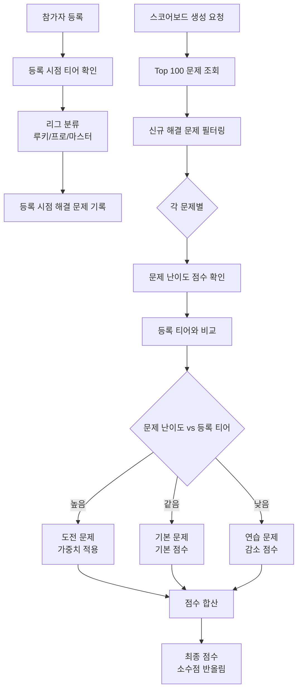
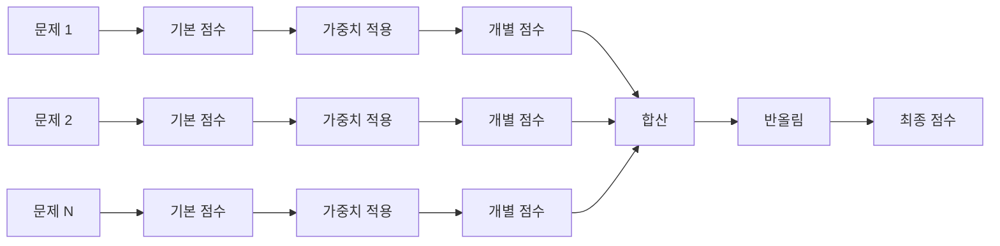

# 깨미 봇 점수 산정 시스템

## 목차
- [점수 산정 개요](#점수-산정-개요)
- [리그 분류 체계](#리그-분류-체계)
- [티어별 기본 점수](#티어별-기본-점수)
- [가중치 시스템](#가중치-시스템)
- [점수 계산 공식](#점수-계산-공식)
- [계산 예시](#계산-예시)
- [특수 케이스](#특수-케이스)
- [FAQ](#faq)

---

## 점수 산정 개요

깨미 봇은 백준 알고리즘 대회 참가자들의 문제 풀이 성과를 공정하게 평가하기 위한 점수 산정 시스템을 사용합니다.

### 핵심 원칙

1. **실력 기반 분류**: 참가자의 등록 시점 티어에 따라 리그를 분류
2. **차등 가중치**: 도전/기본/연습 문제에 따라 차등 점수 부여
3. **신규 문제만 인정**: 대회 참가 후 새로 해결한 문제만 점수 인정
4. **공정한 경쟁**: 같은 리그 내에서 동일한 기준 적용

### 점수 산정 흐름



---

## 리그 분류 체계

참가자는 **대회 등록 시점의 백준 티어**에 따라 3개 리그 중 하나로 분류됩니다.

### 리그 구분

| 리그 | 티어 범위 | 설명 |
|------|----------|------|
| **🌱 루키 (Rookie)** | Unrated ~ Silver V (티어 0-6) | 알고리즘 입문자 |
| **⚡ 프로 (Pro)** | Silver IV ~ Gold V (티어 7-11) | 중급 실력자 |
| **👑 마스터 (Master)** | Gold IV 이상 (티어 12+) | 고급 실력자 |

### 리그 분류 코드
```go
// getUserLeague in scoring/calculator.go
func getUserLeague(startTier int) int {
    if startTier <= 6 {
        return LeagueRookie  // 0
    }
    if startTier <= 11 {
        return LeaguePro     // 1
    }
    return LeagueMaster      // 2
}
```

### 중요 사항
- 리그는 **등록 시점 티어**로만 결정되며, 대회 중 티어가 변경되어도 리그는 바뀌지 않음
- 같은 리그 내에서만 순위 경쟁
- 각 리그는 독립적인 스코어보드를 가짐

---

## 티어별 기본 점수

solved.ac의 티어 시스템을 기반으로 한 기본 점수표입니다.

### 전체 티어 점수표

| 티어 레벨 | 티어 이름 | 기본 점수 | 티어 레벨 | 티어 이름 | 기본 점수 |
|---------|----------|----------|---------|----------|----------|
| 0 | Unranked | 0 | 16 | Platinum V | 28 |
| 1 | Bronze V | 1 | 17 | Platinum IV | 30 |
| 2 | Bronze IV | 2 | 18 | Platinum III | 32 |
| 3 | Bronze III | 3 | 19 | Platinum II | 35 |
| 4 | Bronze II | 4 | 20 | Platinum I | 37 |
| 5 | Bronze I | 5 | 21 | Diamond V | 40 |
| 6 | Silver V | 8 | 22 | Diamond IV | 42 |
| 7 | Silver IV | 10 | 23 | Diamond III | 45 |
| 8 | Silver III | 12 | 24 | Diamond II | 47 |
| 9 | Silver II | 14 | 25 | Diamond I | 50 |
| 10 | Silver I | 16 | 26 | Ruby V | 55 |
| 11 | Gold V | 18 | 27 | Ruby IV | 60 |
| 12 | Gold IV | 20 | 28 | Ruby III | 65 |
| 13 | Gold III | 22 | 29 | Ruby II | 70 |
| 14 | Gold II | 23 | 30 | Ruby I | 75 |
| 15 | Gold I | 25 | 31+ | Master | 80 |

### 티어 점수 특징

#### 📊 점수 증가 패턴
- **Bronze**: 1점 단위 증가 (1, 2, 3, 4, 5)
- **Silver**: 2점 단위 증가 (8, 10, 12, 14, 16)
- **Gold**: 2점 단위 증가 (18, 20, 22, 23, 25)
- **Platinum**: 2~3점 단위 증가 (28, 30, 32, 35, 37)
- **Diamond**: 2~3점 단위 증가 (40, 42, 45, 47, 50)
- **Ruby**: 5점 단위 증가 (55, 60, 65, 70, 75)
- **Master**: 80점 (고정)

#### 💡 설계 의도
- 티어가 높을수록 점수 격차가 커짐
- Ruby 이상부터 점수 증가폭이 크게 증가하여 고난이도 문제 풀이 장려

---

## 가중치 시스템

문제의 난이도와 참가자의 등록 티어를 비교하여 가중치를 적용합니다.

### 가중치 적용 기준

| 문제 유형 | 조건 | 설명 |
|---------|------|------|
| **🎯 도전 문제** | 문제 티어 > 등록 티어 | 자신보다 높은 난이도 문제 |
| **📌 기본 문제** | 문제 티어 = 등록 티어 | 자신과 같은 난이도 문제 |
| **📚 연습 문제** | 문제 티어 < 등록 티어 | 자신보다 낮은 난이도 문제 |

### 리그별 가중치 계수

#### 🌱 루키 리그 (Unrated ~ Silver V)

| 문제 유형 | 가중치 | 실제 점수 예시 |
|---------|-------|--------------|
| 도전 문제 | **×1.4** | Bronze III (3점) × 1.4 = 4.2점 |
| 기본 문제 | **×1.0** | Bronze III (3점) × 1.0 = 3.0점 |
| 연습 문제 | **×0.5** | Bronze I (5점) × 0.5 = 2.5점 |

**설계 의도**:
- 도전 문제에 높은 보너스를 주어 성장 유도
- 연습 문제는 절반만 인정하여 새로운 도전 장려

#### ⚡ 프로 리그 (Silver IV ~ Gold V)

| 문제 유형 | 가중치 | 실제 점수 예시 |
|---------|-------|--------------|
| 도전 문제 | **×1.2** | Silver III (12점) × 1.2 = 14.4점 |
| 기본 문제 | **×1.0** | Silver III (12점) × 1.0 = 12.0점 |
| 연습 문제 | **×0.8** | Silver V (8점) × 0.8 = 6.4점 |

**설계 의도**:
- 도전 문제 보너스를 완화 (1.4 → 1.2)
- 연습 문제도 어느 정도 인정 (0.5 → 0.8)
- 균형잡힌 학습 유도

#### 👑 마스터 리그 (Gold IV 이상)

| 문제 유형 | 가중치 | 실제 점수 예시 |
|---------|-------|--------------|
| 도전 문제 | **×1.0** | Gold III (22점) × 1.0 = 22.0점 |
| 기본 문제 | **×1.0** | Gold III (22점) × 1.0 = 22.0점 |
| 연습 문제 | **×1.0** | Gold V (18점) × 1.0 = 18.0점 |

**설계 의도**:
- 모든 문제에 동일 가중치 적용
- 고급 실력자들은 난이도와 관계없이 문제 풀이 자체에 집중
- 문제 수와 난이도만으로 경쟁

### 가중치 적용 코드
```go
// scoring/calculator.go
func getWeightByLeague(problemLevel, startTier, userLeague int) float64 {
    switch userLeague {
    case LeagueRookie:
        return getRookieWeight(problemLevel, startTier)
    case LeaguePro:
        return getProWeight(problemLevel, startTier)
    case LeagueMaster:
        return getMasterWeight(problemLevel, startTier)
    default:
        return 1.0
    }
}

func getRookieWeight(problemLevel, startTier int) float64 {
    if problemLevel > startTier {
        return 1.4  // 도전
    } else if problemLevel == startTier {
        return 1.0  // 기본
    } else {
        return 0.5  // 연습
    }
}
```

---

## 점수 계산 공식

### 기본 공식

```
최종 점수 = Σ (문제 기본 점수 × 가중치)
         = Σ (Tier Points × Weight)
```

### 계산 단계



### 상세 계산 과정

1. **참가자 정보 확인**
   - 등록 시점 티어: `startTier`
   - 등록 시점 해결 문제 목록: `startProblemIDs`

2. **리그 결정**
   ```
   if startTier <= 6:
       league = 루키
   elif startTier <= 11:
       league = 프로
   else:
       league = 마스터
   ```

3. **Top 100 문제 조회**
   - solved.ac API에서 현재 해결한 상위 100개 문제 조회
   - 각 문제의 난이도(level) 확인

4. **신규 문제 필터링**
   ```
   for each problem in top100:
       if problem.id NOT IN startProblemIDs:
           // 대회 참가 후 해결한 문제만 점수 인정
           calculate_score(problem)
   ```

5. **개별 문제 점수 계산**
   ```
   problemScore = TierPoints[problem.level]
   weight = getWeight(problem.level, startTier, league)
   finalScore += problemScore × weight
   ```

6. **최종 점수 반올림**
   ```
   finalScore = round(totalScore)
   ```

### 코드 구현

```go
// scoring/calculator.go
func CalculateScoreWithTop100(top100 *api.Top100Response,
                                startTier int,
                                startProblemIDs []int) float64 {
    // 1. 시작 문제들을 맵으로 변환 (O(1) 조회)
    startProblemsMap := make(map[int]bool)
    for _, id := range startProblemIDs {
        startProblemsMap[id] = true
    }

    // 2. 리그 결정
    userLeague := getUserLeague(startTier)

    totalScore := 0.0

    // 3. Top 100 문제 순회
    for _, problem := range top100.Items {
        // 참가 전 해결한 문제 제외
        if startProblemsMap[problem.ProblemID] {
            continue
        }

        // 문제 난이도 점수
        difficultyValue := float64(problem.Level)
        if difficultyValue == 0 {
            continue
        }

        // 가중치 계산
        weight := getWeightByLeague(problem.Level, startTier, userLeague)

        // 점수 합산
        score := difficultyValue * weight
        totalScore += score
    }

    // 4. 반올림
    return math.Round(totalScore)
}
```

---

## 계산 예시

### 예시 1: 루키 리그 참가자

**참가자 정보**:
- 이름: 홍길동
- 등록 티어: Bronze III (레벨 3)
- 리그: 🌱 루키

**대회 중 해결한 문제**:

| 문제 | 난이도 | 기본 점수 | 유형 | 가중치 | 획득 점수 |
|-----|-------|----------|------|--------|----------|
| 문제 A | Bronze IV (2) | 2 | 연습 | ×0.5 | 1.0 |
| 문제 B | Bronze III (3) | 3 | 기본 | ×1.0 | 3.0 |
| 문제 C | Bronze II (4) | 4 | 도전 | ×1.4 | 5.6 |
| 문제 D | Silver V (6) | 8 | 도전 | ×1.4 | 11.2 |
| 문제 E | Bronze I (5) | 5 | 도전 | ×1.4 | 7.0 |

**계산**:
```
총점 = 1.0 + 3.0 + 5.6 + 11.2 + 7.0 = 27.8
최종 점수 = round(27.8) = 28점
```

### 예시 2: 프로 리그 참가자

**참가자 정보**:
- 이름: 김철수
- 등록 티어: Silver II (레벨 9)
- 리그: ⚡ 프로

**대회 중 해결한 문제**:

| 문제 | 난이도 | 기본 점수 | 유형 | 가중치 | 획득 점수 |
|-----|-------|----------|------|--------|----------|
| 문제 A | Silver V (6) | 8 | 연습 | ×0.8 | 6.4 |
| 문제 B | Silver II (9) | 14 | 기본 | ×1.0 | 14.0 |
| 문제 C | Silver I (10) | 16 | 도전 | ×1.2 | 19.2 |
| 문제 D | Gold V (11) | 18 | 도전 | ×1.2 | 21.6 |
| 문제 E | Gold IV (12) | 20 | 도전 | ×1.2 | 24.0 |

**계산**:
```
총점 = 6.4 + 14.0 + 19.2 + 21.6 + 24.0 = 85.2
최종 점수 = round(85.2) = 85점
```

### 예시 3: 마스터 리그 참가자

**참가자 정보**:
- 이름: 박영희
- 등록 티어: Gold II (레벨 14)
- 리그: 👑 마스터

**대회 중 해결한 문제**:

| 문제 | 난이도 | 기본 점수 | 유형 | 가중치 | 획득 점수 |
|-----|-------|----------|------|--------|----------|
| 문제 A | Gold V (11) | 18 | 연습 | ×1.0 | 18.0 |
| 문제 B | Gold II (14) | 23 | 기본 | ×1.0 | 23.0 |
| 문제 C | Gold I (15) | 25 | 도전 | ×1.0 | 25.0 |
| 문제 D | Platinum V (16) | 28 | 도전 | ×1.0 | 28.0 |
| 문제 E | Platinum IV (17) | 30 | 도전 | ×1.0 | 30.0 |

**계산**:
```
총점 = 18.0 + 23.0 + 25.0 + 28.0 + 30.0 = 124.0
최종 점수 = round(124.0) = 124점
```

---

## 특수 케이스

### 1. Unranked (티어 0) 문제

**처리 방식**: 점수 미인정

```go
difficultyValue := float64(problemLevel)
if difficultyValue == 0 {
    continue  // 점수 0, 건너뜀
}
```

**이유**:
- Unranked 문제는 난이도가 책정되지 않은 문제
- 공정한 점수 산정이 불가능하므로 제외

### 2. 대회 참가 전 해결한 문제

**처리 방식**: 점수 미인정

```go
if startProblemsMap[problem.ProblemID] {
    continue  // 이미 해결한 문제, 건너뜀
}
```

**예시**:
- 참가 전 Top 100: [1000, 1001, 1002, ...]
- 참가 후 Top 100: [1000, 1001, 1002, 2000, 2001, ...]
- **점수 인정**: 2000번, 2001번만 (신규 문제)

**이유**:
- 대회 기간 중의 성장만을 측정
- 기존 실력이 아닌 노력을 평가

### 3. Top 100을 초과하는 문제

**처리 방식**: Top 100에 포함되지 않으면 점수 미인정

**설명**:
- solved.ac API는 최대 100개 문제만 반환
- 참가자가 100개 이상 풀어도 상위 100개만 집계
- 난이도가 높은 문제가 우선순위

**영향**:
- 고난이도 문제를 푸는 것이 유리
- Bronze 100개 < Gold 50개

### 4. Master 티어 (31+) 처리

**처리 방식**: 모두 80점으로 통일

```go
// models/tier.go
if tier > 31 {
    return tm.tiers[31]  // Master (80점)
}
```

**이유**:
- 31 이상의 극상위 티어는 모두 Master로 간주
- 점수 상한선 설정으로 밸런스 유지

### 5. 소수점 처리

**처리 방식**: 반올림 (Round)

```go
return math.Round(totalScore)
```

**예시**:
- 127.4 → 127점
- 127.5 → 128점
- 127.6 → 128점

**이유**:
- 정수 점수로 간결한 순위 표시
- 동점자 감소

### 6. Top 100 조회 실패

**처리 방식**: 점수 0점

```go
top100, err := calculator.client.GetUserTop100(ctx, handle)
if err != nil {
    return 0, err
}
```

**발생 상황**:
- 네트워크 오류
- API 장애
- 존재하지 않는 사용자

**대응**:
- 에러 로그 기록
- 사용자에게 재시도 안내

---

## FAQ

### Q1. 대회 중 티어가 올라가면 리그도 바뀌나요?

**A**: 아니요. 리그는 **등록 시점의 티어**로만 결정됩니다.

**예시**:
- 등록 시: Bronze III (루키 리그)
- 대회 중: Silver IV로 상승
- **리그**: 여전히 루키 리그

**이유**: 공정한 경쟁을 위해 리그는 고정

---

### Q2. 같은 문제를 여러 번 풀면 점수가 중복으로 들어가나요?

**A**: 아니요. Top 100은 **중복 없이 100개 문제**만 포함됩니다.

**설명**: solved.ac API가 자동으로 중복 제거

---

### Q3. Top 100에서 밀려난 문제는 어떻게 되나요?

**A**: 점수에서 제외됩니다.

**예시**:
- 처음: Bronze 문제 100개 (총점 300)
- 나중: Bronze 50개 + Silver 50개 (총점 600)
- Bronze 50개는 Top 100에서 제외되어 점수 미반영

**전략**: 고난이도 문제를 푸는 것이 유리

---

### Q4. 연습 문제도 풀어야 하나요?

**A**: 리그에 따라 다릅니다.

- **루키**: 연습 문제는 0.5배만 인정되므로 도전 문제 추천
- **프로**: 연습 문제도 0.8배 인정되므로 균형있게 풀이
- **마스터**: 모든 문제가 동일하므로 난이도 상관없음

---

### Q5. 점수가 갑자기 줄어들 수 있나요?

**A**: 네, Top 100에서 밀려난 경우 줄어들 수 있습니다.

**예시**:
```
초기: Bronze 100개 → 총점 300점
이후: Gold 100개 → 총점 2000점
(Bronze 문제들은 Top 100에서 제외됨)
```

**결과**: 절대 점수는 증가했지만, Bronze 문제 점수는 사라짐

---

### Q6. 왜 마스터 리그는 가중치가 없나요?

**A**: 고급 실력자들의 특성을 반영한 설계입니다.

**이유**:
1. 이미 높은 수준의 실력 보유
2. 난이도보다 문제 수와 질이 중요
3. 다양한 문제 유형 경험 장려

---

### Q7. 점수 계산이 실시간으로 업데이트되나요?

**A**: 아니요. 스코어보드 생성 시점에만 계산됩니다.

**업데이트 시점**:
- 관리자가 `!스코어보드` 명령어 실행
- 매일 설정된 시간 (기본: 오전 9시) 자동 생성

**이유**: solved.ac API 호출 횟수 제한 및 서버 부하 관리

---

### Q8. 다른 리그 참가자와 점수를 비교할 수 있나요?

**A**: 같은 리그 내에서만 순위가 매겨집니다.

**예시**:
- 루키 1등: 300점
- 프로 1등: 500점
- 마스터 1등: 800점

→ **각 리그별로 독립적인 1등**

**이유**: 리그별 가중치가 달라 직접 비교 불가능

---

### Q9. 점수 계산에 오류가 있는 것 같아요.

**A**: 다음을 확인해주세요:

1. **Top 100 확인**: solved.ac에서 본인의 Top 100 문제 확인
2. **등록 시점 문제 확인**: 대회 참가 전 해결한 문제는 제외됨
3. **가중치 확인**: 리그별로 가중치가 다름
4. **반올림 확인**: 소수점은 반올림됨

**문의**: 여전히 오류가 의심되면 관리자에게 문의

---

### Q10. 점수를 올리는 가장 효율적인 방법은?

**A**: 리그별 전략이 다릅니다.

**🌱 루키 리그**:
- **도전 문제** (1.4배) 집중 공략
- 본인 티어+1 ~ 티어+3 난이도 추천
- Bronze → Silver 문제 위주

**⚡ 프로 리그**:
- 도전 문제 (1.2배)와 기본 문제 균형
- Silver → Gold 문제 위주
- 일부 Platinum 도전

**👑 마스터 리그**:
- 가중치가 없으므로 **고난이도 문제**가 유리
- Platinum, Diamond 문제 위주
- 문제 수보다는 난이도 우선

---

## 참고 자료

### 관련 파일
- 점수 계산 로직: `scoring/calculator.go`
- 티어 정보: `models/tier.go`
- 가중치 상수: `constants/constants.go`

### solved.ac 참고
- [solved.ac 티어 시스템](https://solved.ac/help/tiers)
- [solved.ac API 문서](https://solvedac.github.io/unofficial-documentation/)

### 코드 예시

완전한 점수 계산 예시는 다음 테스트 파일에서 확인할 수 있습니다:
```bash
# 테스트 실행
go test ./scoring -v
```

---

**문서 버전**: 1.0  
**최종 업데이트**: 2025-11-12  
**작성자**: AndyH0ng  
**문의**: stdlib_h 디스코드 DM으로 편하게 문의주세요.
